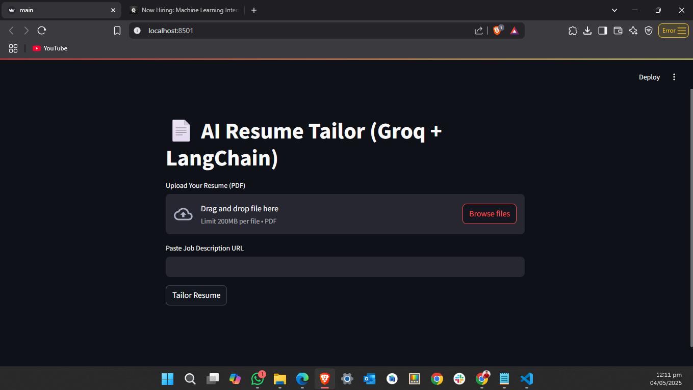

# 🧠 AI Resume Tailor — Streamlit + Groq + LangChain

**AI Resume Tailor** is a smart web app that automatically rewrites and enhances your resume based on any job description. Upload your resume in PDF format, paste the job posting URL, and get a tailored, ATS-friendly resume in seconds — all powered by **Groq's blazing-fast LLMs** and **LangChain**.

 <!-- Replace with actual screenshot -->

---

## 🚀 Features

- 📤 Upload your resume (PDF format only)
- 🌐 Paste any job description URL
- 🧠 AI-enhanced tailoring using Groq + LangChain
- 📄 Clean, professional, and ATS-friendly output
- 🔽 Download your customized resume instantly

---

## 🧰 Tech Stack

| Component         | Technology                  |
|------------------|-----------------------------|
| UI               | Streamlit                   |
| LLM Backend      | Groq (LLaMA3 via LangChain) |
| Resume Parsing   | PyMuPDF (fitz)              |
| PDF Generation   | FPDF                        |
| Web Scraping     | LangChain `WebBaseLoader`   |

---

## 📦 Installation

### 1. Clone the Repo

```bash
git clone https://github.com/yourusername/ai-resume-tailor.git
cd ai-resume-tailor
